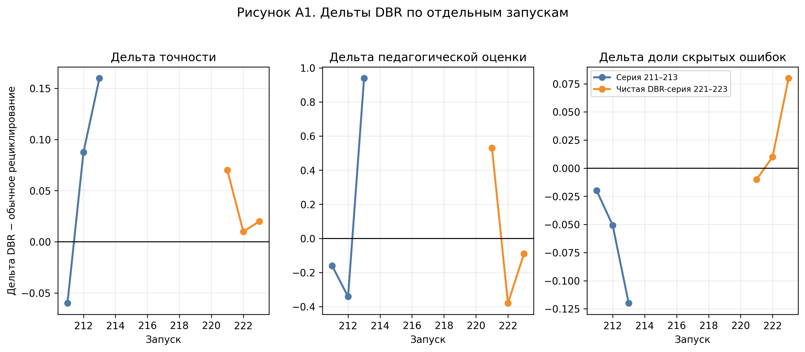
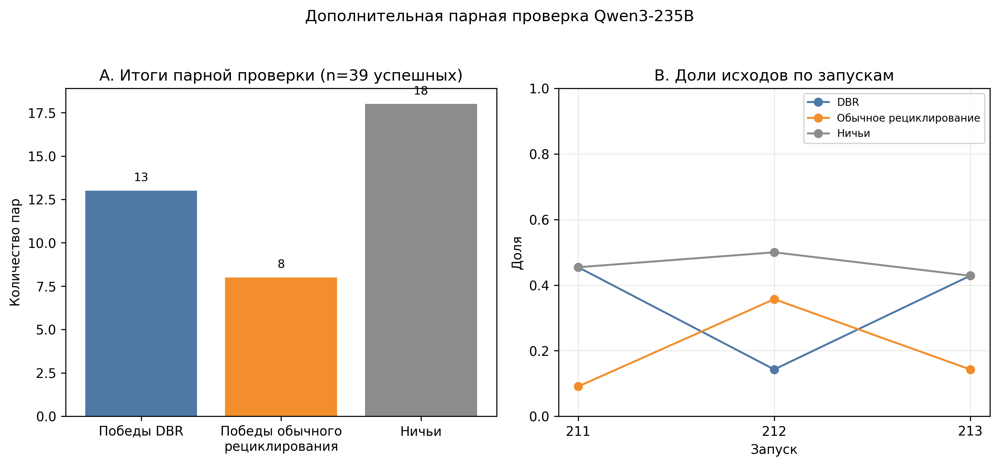
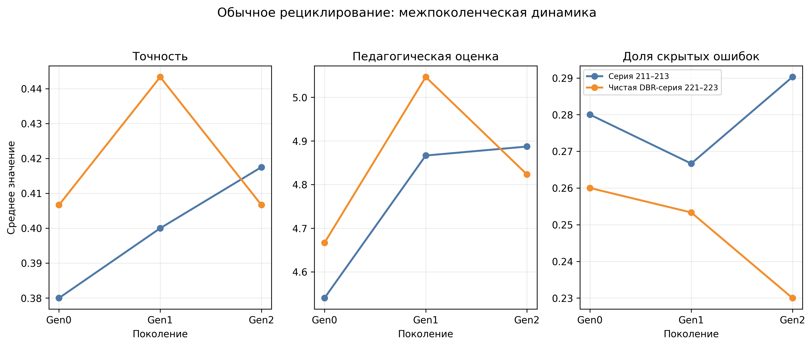

# Приложение D. Дополнительные рисунки

## Рисунок A1. Дельты DBR по отдельным запускам

**Рисунок A1. Дельты DBR по отдельным запускам.**
Рисунок показывает чувствительность итоговых эффектов DBR к запуску. Для доли скрытых ошибок отрицательная дельта означает улучшение.

## Рисунок A2. Дополнительная парная проверка Qwen3-235B

**Рисунок A2. Дополнительная парная проверка Qwen3-235B.**
Из 48 выбранных пар успешно оценены 39; DBR выбран 13 раз, обычное рециклирование — 8 раз, ничья — 18 раз. Высокая доля ничьих подчёркивает, что это проверка чувствительности, а не основное доказательство.

## Рисунок A3. Обычное рециклирование: межпоколенческая динамика

**Рисунок A3. Обычное рециклирование: межпоколенческая динамика.**
Рисунок не демонстрирует сильную монотонную форму коллапса; он показывает ненулевую дефектную нагрузку и нестабильность педагогических метрик.
